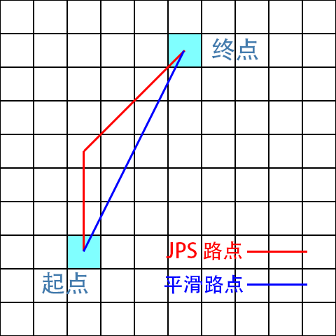
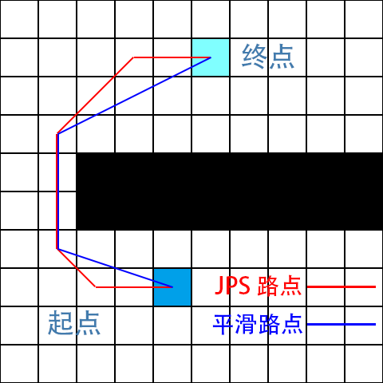

# lua-navigation
基于网格的寻路算法(jps+路径平滑)，起点终点可以是浮点型，能满足像素级寻路。

# 主要步骤和原理
+ 先把起点终点拉条直线，判断是否有途径障碍点
+ 如果有障碍点，执行jps跳点算法找出路点，jps是常见的基于A*算法的优化，这里不赘述
+ 因为jps的路点一般是带锯齿的，我们需要做对路点进行平滑处理。目前的办法比较粗暴，从两端开始往中间靠拢，判断在任意两点之前拉直线是否有阻挡，如无，则把中间的点全部剔除。
+ 最后判断一下起点和终点的地方使用浮点数值，检查跟障碍是否有交叉

# WARNING
__平滑算法的时间复杂度为n^2，并且如果点与点之前的距离越长，要遍历判断阻挡的次数就越多，所以理论上在复杂的地形中效率会非常低。这个算法更适合像SLG这种地图很大很空旷的场景，它产生的路点不会太多，而且大部分的近距离寻路都在第一步被拦截__

# 参考
+ https://github.com/rangercyh/jps