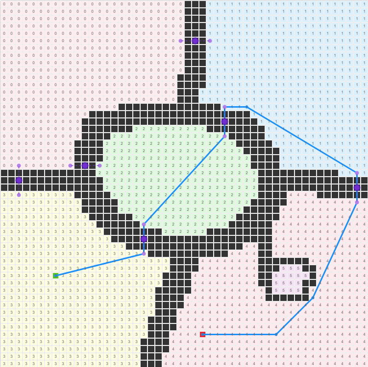

# SLG寻路算法(jps+路径平滑)
本项目是专门为SLG大地图优化设计的寻路算法

# A*算法的最坏情况是什么？该如何解决？
A*算法的最坏情况是，两个不相通的区域之间的寻路，即使这终点就在离起点很近的地方，也会导致算法一直遍历完整张地图为止，才能得出无法到达的结果。

解决这个问题的思路也很简单，在地图初始化，或者阻挡发生变化的时候，给地图所有想通的区域提前做好分区。在开始寻路之前，判断如果起点和终点是同一个区域id，也直接就能得出无法到达的结果，从而避免遍历全图的最坏情况。

# 本算法针对A*进行了以下改进
+ 使用jps跳点算法加速A*的遍历速度
+ 对地图进行了全量分区以及动态分区(主要解决SLG玩家摆建筑堵路造成的A*的最坏情况)
+ 对A*输出的路点做平滑处理(就是点与点之间尽量走直线，不按格子走)
+ 在lua层添加了传送点的支持(其实就是SLG游戏中州与州之间的关隘)，相当于在区域之间再做了更上一层的图的结构，解决SLG超大地图超远距离间的寻路问题
